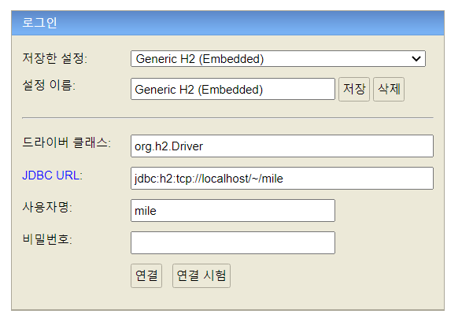

# 트리플 과제 전형 제출
### 1. 유저 이름이 mile, 비밀번호 X 인 유저 하나를 새로 만들어주시거나(권한도 부여) 기존에 있는 사용자로 하실거면 h2 로그인 화면에서 해당 사용자명과 비밀번호로 입력해줍니다.
1. cmd 창을 열어줍니다.(윈도우 기준) 
2. mysql -u root -p 입력 후 패스워드 입력하기
3. create user 'mile'@'%'; 입력하기
4. grant all privileges on *.* to 'mile'@'%'; 입력
5. FLUSH PRIVILEGES;로 최종적으로 권한을 적용시킵니다.

### 2. h2 database 설치
- https://www.h2database.com/
- 스프링 부트 버전과 동일한 버전으로 다운받습니다. 2.7.1
- h2 console을 실행해줍니다.
- 창이 뜨면 아래와 같이 입력해주고 연결을 누릅니다.

 
### 3. 프로젝트를 git clone해서 열고 gradle 동기화를 해줍니다.
- intelliJ로 작업 했습니다.

### 4. resources 안의 db 폴더의 start.sql을 1회 실행해줍니다.

### 5. 프로젝트를 한 번 실행한 후 application.yml에서 ```ddl-auto: create```라고 적혀있는 부분을 ```ddl-auto: none```으로 바꿔줍니다.